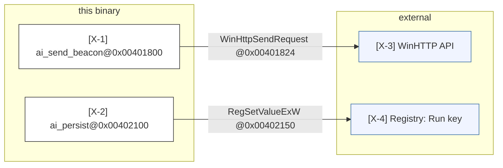

# Mode: Integration Points (binary-graph adaptation)

## On this host

Retargeted in full -- this is the one mode this pack adapts beyond a banner note, because
imported/exported APIs and network/file-system boundaries are directly visible in a stripped
binary through `pyghidra-mcp`, unlike the other seven modes' source/framework-specific signals.

## What this mode answers

Where does this binary touch the outside world? Every external boundary visible from the
binary's own symbol tables and strings: imported APIs (network, file, process, registry, crypto),
exported APIs (if the binary is itself a library), and third-party/OS services it links against.

Callout prefix: `X-` (eXternal). Primary mermaid: `graph LR` boundary diagram (upstream's C4
context diagram is source-service-oriented; a plain trust-zone `graph LR` reads better for a
single binary's import/export table). Optional secondary: a markdown dependency table for
integrations not worth a diagram node (e.g., every individual registry key).

## Target signals

Sub-agents look for, in order of priority:

1. **Imported APIs**, via `list_imports` -- every import IS a candidate integration node. Group by
   category (same categories `reva-binary-triage` already uses for suspicious-import survey, so
   the two skills read consistently):
   - **Network**: `connect`, `send`, `recv`, `WSAStartup`, `getaddrinfo`, `WinHttpOpen`,
     `WinHttpSendRequest`, `curl_*`, `socket`
   - **File I/O**: `CreateFile`, `WriteFile`, `ReadFile`, `fopen`, `fwrite`, `fread`
   - **Process manipulation**: `CreateProcess`, `exec`, `fork`, `system`, `WinExec`,
     `ShellExecute`
   - **Memory operations**: `VirtualAlloc`, `VirtualProtect`, `mmap`, `mprotect`
   - **Crypto**: `CryptEncrypt`, `CryptDecrypt`, `EVP_*`, `AES_*`, `bcrypt`, `RC4`
   - **Registry**: `RegOpenKey`, `RegSetValue`, `RegQueryValue`
   - **Anti-analysis**: `IsDebuggerPresent`, `CheckRemoteDebuggerPresent`, `ptrace`
2. **Exported APIs**, via `list_exports` -- only relevant if the binary is a library/DLL others
   call into; each export is a node showing what this binary exposes to its own callers.
3. **Network/C2 strings**, via `search_strings` -- URLs, IPs, domains, User-Agent strings, API
   endpoint paths. Cite the string hit's address; cite the calling function (via `list_xrefs`
   direction="to" on the string) as the in-binary adapter node.
4. **File-system contracts**, via `search_strings` -- known paths the binary reads/writes
   (config files, dropped files, well-known system paths). Same citation pattern as network
   strings.
5. **Registry contracts**, via `search_strings` -- registry key paths referenced as string
   literals (`HKEY_...`, `SOFTWARE\...`), cross-referenced the same way.
6. **Dynamic/runtime API resolution**, via `decompile_function` on functions that call
   `GetProcAddress`/`LoadLibrary` -- these hide an integration behind a resolved-at-runtime
   pointer; the target API name is often visible as a string argument even when the call itself
   is indirect. Mark the resulting edge `confidence: medium` at best -- you are inferring the
   target from a string near the resolution call, not from a direct import-table entry.

## What to capture as nodes

- Each **external system/API family** is a node, classDef `external`. Examples: "Windows
  WinHTTP API", "Windows Registry", "C2 server (from string @0x00405c20)".
- Each **in-binary adapter function** that calls into that external system is a node, classDef
  `cited`. Example: `ai_send_beacon@0x00401800` mediates the "C2 server" node.
- Trust-zone subgraphs when meaningful: "this binary", "OS APIs", "network", "file system",
  "registry".

## What NOT to capture as nodes

- Every individual internal function call -- that's control flow, not integrations.
- Every individual registry key or file path when there are many similar ones -- group under one
  logical node ("Persistence registry keys: `Run`, `RunOnce`" as one node with both keys named in
  the report) unless a specific key is individually significant.
- Standard runtime/CRT imports that don't cross a real external boundary (e.g., `memcpy`, `malloc`
  wrappers) -- these are implementation, not integration, the same distinction upstream draws for
  standard-library imports.

## Edges

- **In-binary adapter -> external system**: solid arrow, cites the call-site address (from
  `list_xrefs` or `disassemble`), not the import-table entry alone -- the import table says the
  binary *can* call it; the call site says it *does*, and where.
- **External system -> in-binary adapter**: rare for a binary with no exposed listener; use only
  if the binary itself exports a callback or hosts a service.
- **Edge labels** name the concrete API or protocol: `WinHttpSendRequest`, `HTTPS POST`, `registry
  write`, `CreateProcess argv`.



## Sub-agent prompt seed

```
# Mode
Integrations -- every place this binary touches something outside itself.

# What to find
1. Imported APIs via list_imports -- categorize (network, file I/O, process, memory, crypto,
   registry, anti-analysis) per the categories above.
2. Exported APIs via list_exports, if the binary is a library.
3. Network/C2/file/registry strings via search_strings -- cite the string's address, then use
   list_xrefs (direction="to") to find the calling function as the in-binary adapter.
4. Dynamic API resolution (GetProcAddress/LoadLibrary) via decompile_function -- mark these edges
   confidence: medium, not high.

# What NOT to find
- Internal function calls with no external boundary (control flow's job).
- Standard runtime/CRT imports (memcpy, malloc) unless they cross a real external boundary.
- Every individual registry key/path when several are similar -- group them.

# Capture pattern
- One in-binary adapter node (function@address) + one external-system node + one edge with a
  protocol/API label citing the call-site address.
- Use trust-zone subgraphs: "this binary", "OS APIs", "network", "file system", "registry".

# Confidence
- high: a direct import-table call you traced to a specific call-site address.
- medium: a dynamically-resolved API (GetProcAddress) or a string-proximity inference.
- Absence claims ("no network activity") -- check list_imports/search_strings first; discard if
  a network API or URL-shaped string exists anywhere in the binary.
```

## Common pitfalls

- **Confusing an import-table entry with a confirmed integration.** `list_imports` says the
  binary *can* call `WinHttpSendRequest`; only a traced call site says it *does*, and only that
  traced call gets a `high`-confidence edge.
- **Missing string-based integrations.** A hardcoded URL or registry path is an integration even
  without an obviously-named API call nearby -- trace it via `list_xrefs`.
- **Listing every import.** A 100-node integrations diagram from a large import table is
  unreadable. Group by category; only pull out individually-significant imports (the ones
  `reva-binary-triage` already flagged as suspicious) as their own nodes.
- **Treating a resolved-at-runtime API as certain.** See the confidence rule above -- `medium` at
  best, never `high`, for anything behind `GetProcAddress`.

## Cross-mode boundary

| Belongs to integrations | Belongs elsewhere |
|---|---|
| "Imports WinHttpSendRequest, called from ai_send_beacon" | "What does ai_send_beacon do with the response?" -> data-flow |
| "Registry Run key write for persistence" | "When during execution does this write happen?" -> control-flow |
| "GetProcAddress call resolves an unknown API by string" | "What happens if resolution fails?" -> failure-modes |
| "String @0x00405c20 looks like a C2 URL" | "Is this URL reachable from user input?" -> data-flow |
